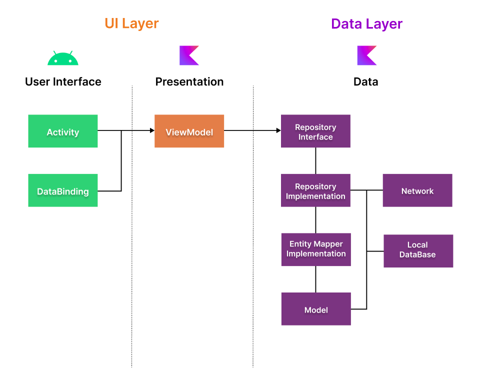

<h1 align="center">UserGithubAppMVVM</h1>

  
    

  
UserGithubAppMVVM demonstrates modern Android development with Multi Modular, Koin, Coroutines, Flow, Jetpack (Room, ViewModel), and Material Design based on MVVM architecture.

 

## Open API

UserGithubAppMVVM using the [GithubApi]([https://pokeapi.co/](https://api.github.com/)) for constructing RESTful API. 
GithubApi provides a RESTful API interface to highly detailed objects built from thousands of lines of data related to Github.

### Continuous Integration

UserGithubAppMVVM using Circle ci, Is a service to create continuous integration. Interestingly, apart from using your own server, you can also use the hosting that has been provided. For configuration you can also use YAML. In addition, there is also a ready-to-use docker image. This service can also be directly integrated with Github and Bitbucket quickly

## Architecture
**UserGithubAppMVVM** is based on the MVVM architecture and the Repository pattern, which follows the [Google's official architecture guidance](https://developer.android.com/topic/architecture).

### UI Layer

### Data Layer

### Encryption

Implement encryption on Room Database with SQLCipher on UserGithubAppMVVM.

### Multi Module

The use of multi-modules in software development provides advantages in separation of functionality, dependency management, reusability, team collaboration, testing and scalability.

-Module Favorite User: This module is responsible for managing the list of user favorites in the application.  
-Module Core: This module serves as the core of the application and contains components that can be used by other modules. 
-Module App: This module is the main application module that combines and uses the functionality of the Favorite User and Core modules. 

